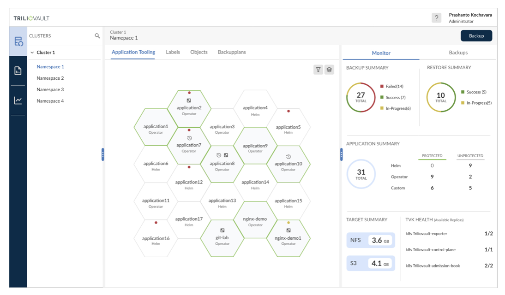
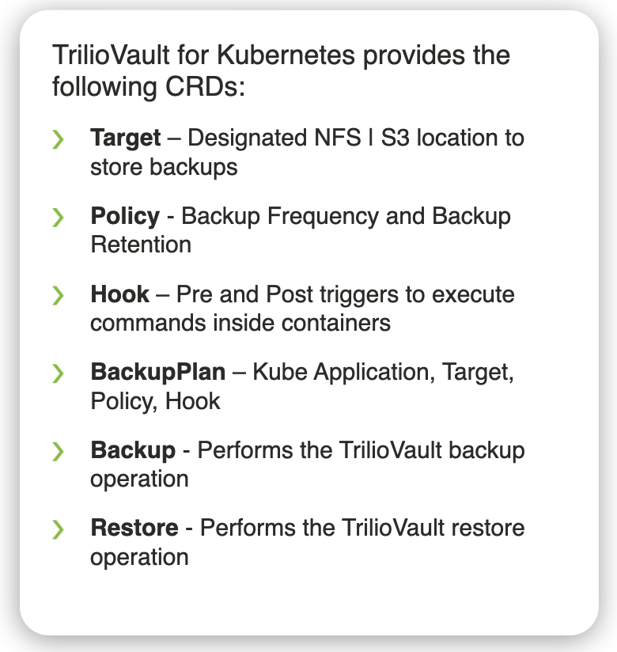
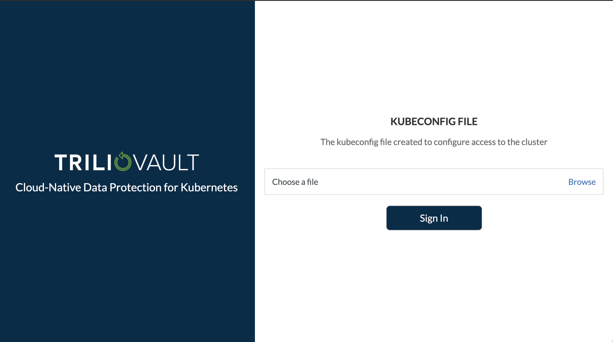

# TrilioVault for Kubernetes UI Permissions

The TrilioVault for Kubernetes UI offers some great features. 

  * Discovery of K8s applications
  * Intuitive management of Backup & Restore Plans in real-time across clouds
  * Simple workflows for managing application consistent backups & restores
  * Ability to migrate application data and metadata to other clouds
  * Monitoring of overall health & performance metrics


 


## What this blog is about
In this blog we would like to show you how to enable permissions on your cluster that will allow RBAC for the TrilioVault for Kubernetes UI. When you install TrilioVault, a service account is created with permissions to access TVK and the UI.  For setting up permission for the 'system:authenticated:oauth' group, follow the below process.


On your cluster, configuring an Oauth Identity Provider, such as GitHub, to validate usernames and passwords may be something you want to do.  If this is the case, some extra steps are required.  For instance, you will need to set up a ClusterRole, as well as, a ClusterRoleBinding.  This blog details the process for setting up that configuration.  

## Cluster Permissions
To access the UI and these feature you will need to create a ClusterRole and a ClusterRoleBinding.

The TrilioVault for Kubernetes UI leverages existing cluster permissions to access the UI. At a minimum users logging into 
the UI need to have read permissions for the TrilioVault group resource. The following ClusterRole shows the minimum level 
of permissions required to access the TVK management console.

  **Example 1:**
  ```
    apiVersion: rbac.authorization.k8s.io/v1
    kind: ClusterRole
     metadata:
       name: svcs-role
    rules:
     - apiGroups: ["triliovault.trilio.io"]
       resources: ["*"]
      verbs: ["get", "list"]
     - apiGroups: ["triliovault.trilio.io"]
       resources: ["policies"]
      verbs: ["create"]
  ```
  
 **You may want to expand these permissions to include some or all of the resources.**
 
  
 
Verbs give users and groups permission to execute actions associated with a resource.  

Verbs: 
 ``` 
create
delete
deletecollection
get
list
patch
update
watch
```
Resources:
```
backupplans                        
backups                            
hooks                                
licenses                         
policies                           
restores                            
targets                             
```
 A list of resources can be gathered by running command:
 ```
oc get crd | grep -i trilio
 ```
 

 **Example 2 - Create Only:**
   ```
    apiVersion: rbac.authorization.k8s.io/v1
    kind: ClusterRole
     metadata:
       name: svcs-role
    rules:
     - apiGroups: ["triliovault.trilio.io"]
       resources: ["*"]
      verbs: ["get", "list"]
     - apiGroups: ["triliovault.trilio.io"]
       resources: ["policies", "targets", "restore", "backups", "backupplans"]
      verbs: ["create"]
  ```
  
  **Example 3 - Delete Only:**  
  
```
    apiVersion: rbac.authorization.k8s.io/v1
    kind: ClusterRole
     metadata:
       name: svcs-role
    rules:
     - apiGroups: ["triliovault.trilio.io"]
       resources: ["policies", "backups", "backupplans"]
       verbs: ["delete"]
 ```
  
  **Example 4 - Full Permissions:**
  
  ```
    apiVersion: rbac.authorization.k8s.io/v1
    kind: ClusterRole
     metadata:
       name: svcs-role
    rules:
     - apiGroups: ["triliovault.trilio.io"]
       resources: ["*"]
      verbs: ["*"]
  ```
 

## Steps to create your ClusterRole in the OCP UI


  **Navigate to User Management -> Roles**
  
  
  Create a new **<em>ClusterRole</em>** for all namespaces
  
  

 
      
## Create a Cluster-wide RoleBinding for your newly created ClusterRole


This cluster uses an oath provider and so we used the **<em>system:authenticated:oauth</em>** group.  In the case that you are using a different provider, find the group based on your provider.

```
kind: RoleBinding
apiVersion: rbac.authorization.k8s.io/v1
metadata:
  name: svcs-binding
subjects:
  - kind: Group
    apiGroup: rbac.authorization.k8s.io
    name: 'system:authenticated:oauth'
roleRef:
  apiGroup: rbac.authorization.k8s.io
  kind: ClusterRole
  name: svcs-role
  ```
  
## Log into OCP with user account (non-admin)
  When logging in with the CLI for the first time, OpenShift creates a **<em>~/.kube/config</em>** file if one does not already exist.
  
 
  Access kubeconfig file with command: 
    
  ```
  cat ~/.kube/config
  ```
  Copy kubeconfig file contents into file on your local machine
  
  With your new ClusterRole and RoleBindings in place, that kubeconfig file should now have the correct permissions to be used with the TVK UI
  
  
  
  
   
